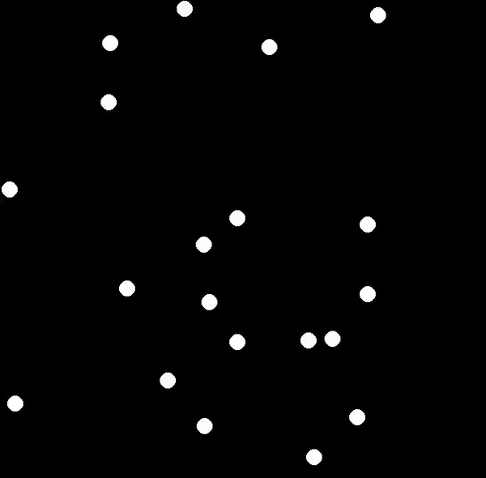
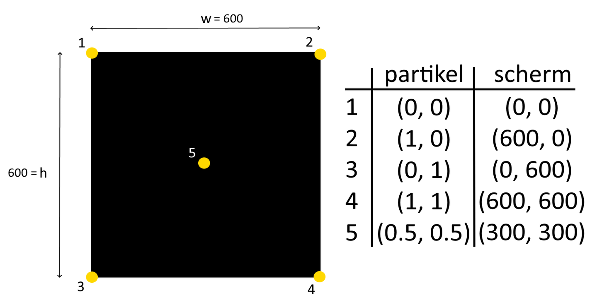
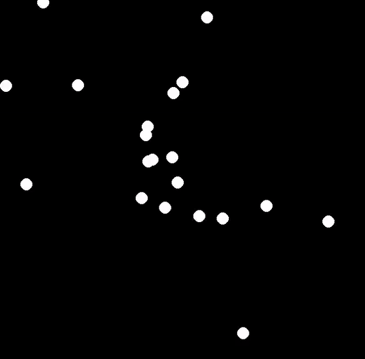
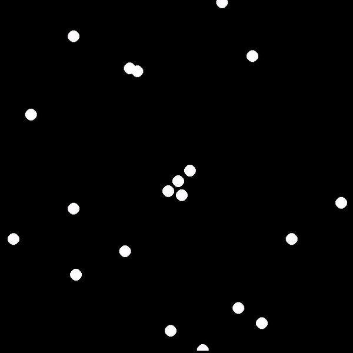
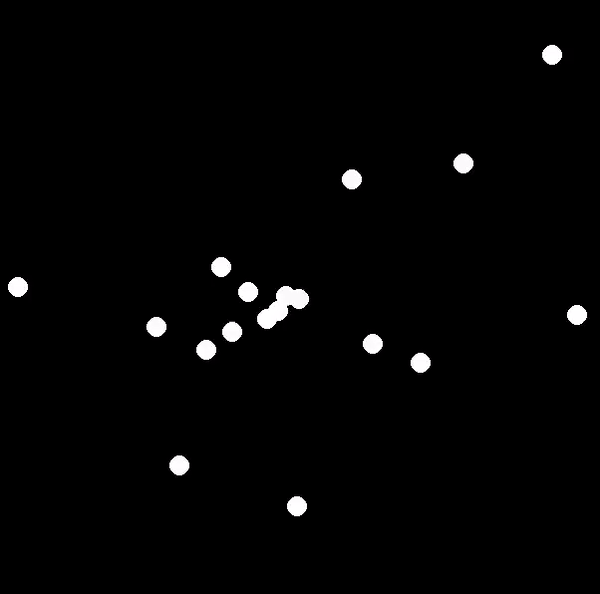
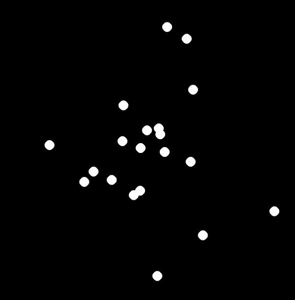
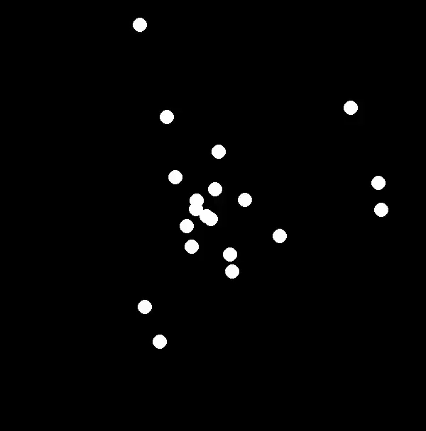
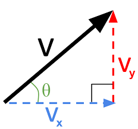
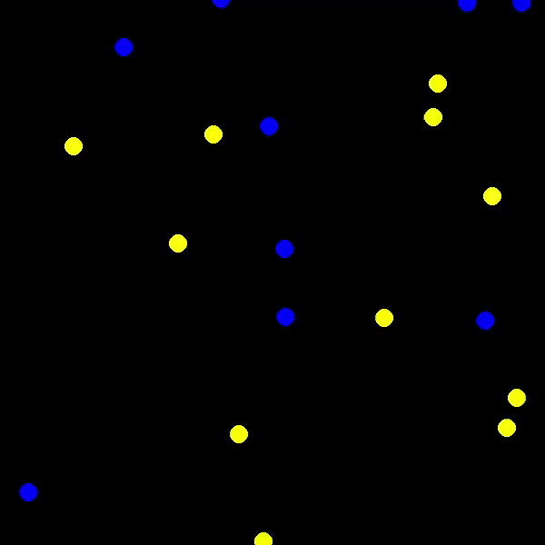
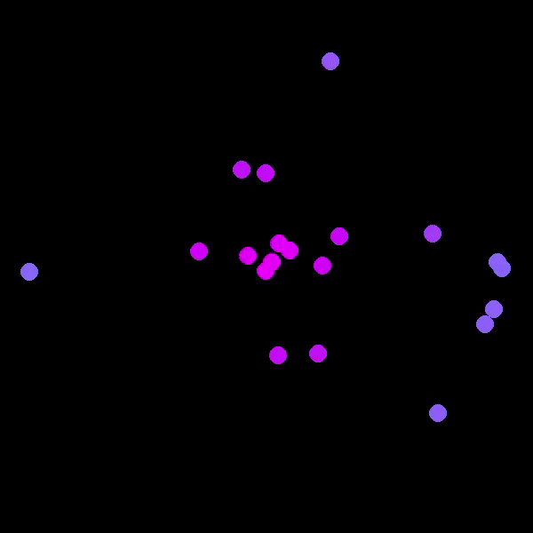

# Toepassing OOP: Particle Storm
In deze toepassing maken jullie een Particle Storm. Dit is een simulatie die de positie van een aantal partikels berekent. Vervolgens toont het ze op een scherm via pygame. Onder is een voorbeeld van hoe een mogelijk eindresultaat eruit kan zien.

<p align="center">
  
</p>

Jullie zullen dit niet in een keer ontwikkelen. Bij het ontwikkelen van (grotere) applicaties is het namelijk best om klein te beginnen. Vervolgens kan je de applicatie steeds verder uitbreiden. Jullie zullen starten met een basisimplementatie (versie 1). Na deze basis, zullen jullie de Particle Storm verder verbeteren en uitbreiden. Dit gebeurt aan de hand van de instructies in deze README. Opgelet, de README vertelt je wat te doen, niet hoe. Experimenteren is dus noodzakelijk. Er zijn in totaal 7 versies. Volledig afmaken is niet vereist. Probeer zo ver mogelijk te raken!

### Tip
Iedere versie bouwt verder op de vorige. Je zal constant code moeten wijzigen. Het is dan ook een goed idee om een kopie te maken van de laatste stabiele versie. Zo kan je altijd teruggaan, mocht dit nodig zijn.

## Basis implementatie (versie 1)
Je hebt 2 bestanden gekregen om mee te starten.
* `particle.py`: bevat de klasse **BoringParticle**, waarmee alle object partikels gemaakt worden. Dit bestand is momenteel nog nagenoeg leeg. Je zal zelf moeten bepalen welke eigenschappen/methoden noodzakelijk zijn.
* `particle_storm.py`: bevat de pygame applicatie. Dit bestand is, op 2 plekken na, compleet. Je zal de code aanvullen op basis van de klasse **BoringParticle** in `particle.py`.

Op het einde van deze versie moet `particle_storm.py` uitvoeren dit resultaat geven. Je hebt een aantal partikels die met een vaste snelheid een willekeurige richting uitgaan. Eenmaal de rand bereikt is, reset het partikel terug naar het midden. Het zal nu een nieuwe willekeurige richting uitgaan.
<p align="center">
  
</p>

De eerste stap is het bepalen van de eigenschappen/methoden van **BoringParticle**. Maak hiervoor gebruik van onderstaand stappenplan.
1. Schrijf eerst uit welke zaken er (nog) moeten gebeuren. Je kan je hiervoor baseren op de ontbrekende code in `particle_storm.py`.
2. Bekijk de lijst uit stap 1. Wat moet je van een partikel weten om deze taken uit te voeren? Dit zijn de eigenschappen.
3. Bekijk opnieuw de lijst uit stap 1. Welke zaken moet het partikel zelf uitvoeren? Dit zijn de methoden.<br> (kijk hiervoor zeker naae TODO 2 in `particle_storm.py`)

### Tip
Het is eenvoudiger om de positie van een partikel tussen 0 en 1 te laten varieren. 
- 0 is hierbij de linker- & bovengrens. 
- 1 is de rechter- & ondergrens.

Hierna kan je in `particle_storm.py` het partikel op het scherm tekenen. Dit door de positie van het partikel te vermenigvuldigen met de breedte en hoogte van het scherm. Deze manier heeft als voordeel dat **BoringParticle** onafhankelijk is van de grootte van het scherm. Onderstaande tekening toont voor een aantal situaties de positie van het partikel & hoe dit zich vertaalt naar het scherm.
<p align="center">
  
</p>
Op deze manier zal de startpositie van ieder partikel dus gelijk zijn aan x=0.5, y=0.5.

## Versie 2
In versie 1 bewegen alle partikels even snel. Dit is vrij saai. Leuker is als deze, net als de richting, willekeurig is. Laat de snelheid van een partikel varieren tussen 0 en de meegegeven snelheid. Na het resetten van een partikel, moet deze een nieuwe willekeurige snelheid krijgen.
<p align="center">
  
</p>


## Versie 3
Versie 2 heeft mogelijks een ernstig gebrek. Ga naar `particle_storm.py` en wijzig de variabele fps naar 10. Zijn de partikels trager? Dan is je simulatie FPS-afhankelijk. Als dit niet het geval is, mag je verdergaan naar versie 4.
<p align="center">
  
</p>

De partikels bewegen met behulp van een methode. Deze methode wordt opgeroepen in de while-loop van `particle_storm.py`. De klok zorgt ervoor dat deze loop *fps* keer per seconde herhaalt. Omdat de fps gedaald is van 120 naar 10, bewegen de partikels exact 12x trager.

Hoever is partikel bewogen na 1 seconde?
```math
afstand = snelheid * fps 
```

De partikels moeten na 1 seconde evenver bewegen, onafhankelijk van de fps. Dit kan door de beweging te vermenigvuldigen met *1/fps*. *1/fps* is de tijd tussen twee frames. De variabele *interval* in `particle_storm.py` geeft deze tijd.

Hoever is partikel bewogen na 1 seconde?
```math
afstand = snelheid * fps * 1/fps
        = snelheid * fps * interval
        = snelheid
```
Zoals je kan zien is de bewogen afstand na 1 seconde vanaf nu altijd enkel afhankelijk van de snelheid.

Op het einde van deze versie moet de simulatie fps-onafhankelijk zijn. Links toont de simulatie bij 10 fps, rechts bij 120 fps. Ze bewegen even snel! Merk wel op dat de simulatie er bij 10 fps veel hakkeriger uitziet.

<p align="center">
  
  
</p>

## Versie 4
De huidige partikels zijn saai. Daarom heet de klasse ook **BoringParticle**. Het zou leuk zijn als partikels verschillende bewegingspatronen hebben. Bijvoorbeeld botsen tegen de muur, meedraaiend met de klok, gravitationele aantrekking tot het midden, ... .

Maak een nieuwe klasse **SpinningParticle** aan in `particle.py`. importeer deze ook in `particle_storm.py` & voeg ze toe aan de lijst *particles*. Deze klasse is bijna identiek aan **BoringParticle**. Er is echter een belangrijk verschil.
```
Partikels van SpinningParticle zullen met de klok meedraaien terwijl ze bewegen.
```

Het resultaat ziet er als volgt uit. Alle BoringParticles zijn in dit voorbeeld weggelaten.
<p align="center">
  
</p>

### Tip
De richting wijzigen kan heel moeilijk of heel makkelijk zijn. Dit afhankelijk van hoe je de beweging berekent. Gebruik je hiervoor een snelheid in de x- en y-richting? Dan kan je best naar een andere methode overgaan.

Bekijk onderstaande figuur. Het is mogelijk om de partikels te bewegen via de rode en blauwe pijl. Dit komt overeen met een onafhankelijke snelheid in de x- en y-richting. Er is echter ook een andere manier. Combineer de zwarte pijl en de groene hoek.
<p align="center">
  
</p>

Je kan dan de snelheid in de x- en y-richting bepalen met goniometrie. Deze hoek moet een willekeurig getal zijn tussen 0 en 2*π.
```math
v_x = v*cos(θ)
```
```math
v_y = v*sin(θ)
```

## Versie 5
Tot nog toe hebben **BoringParticles** en **SpinningParticles** dezelfde kleur. Dit maakt het moeilijk om ze uit elkaar te houden. Voeg een nieuwe eigenschap *kleur* toe aan beide klassen.
- **BoringParticle**: deze moet altijd wit zijn, dus een waarde van (255,255,255).
- **SpinningParticle**: deze moeten van kleur veranderen, naargelang de richting. Bijvoorbeeld rood (255,0,0) wanneer de partikel horizontaal bewegen & blauw (0,255,0) wanneer horizontaal. Iedere richting hiertussen moet een mengeling tussen rood & blauw zijn.

In `particle_storm.py` worden alle partikels wit gekleurd (in *pygame.draw.circle*). Je zal deze vaste waarde dus moeten vervangen door de eigenschap *kleur*. 
<p align="center">
  
</p>

Zorg en tenslotte ook voor dat je kan kiezen hoeveel van ieder soort partikel aan te maken.

## Versie 6
Maak een nieuwe klasse **BouncingParticle**  aan in `particle.py`. Importeer deze ook in `particle_storm.py` & voeg ze toe aan de lijst *particles*. Deze klasse is bijna identiek aan **BoringParticle**. Er is echter een belangrijk verschil.
```
Partikels van BouncingParticle zullen tegen de rand botsen, niet resetten. Na een botsing zal hun hoek wijzigen. Dit afhankelijk van de muur waarmee ze botsen.
```

Alle partikels van **BouncingParticle** zijn afwisselen geel (255,0,255) en blauw (0,0,255). Ze wisselen van kleur nadat ze botsen. 
<p align="center">
  
  
</p>

### Tip
De richting wijzigen kan heel moeilijk of heel makkelijk zijn. Dit afhankelijk van hoe je de beweging berekent. In dit geval is het net het eenvoudigst om meteen uit te gaan van een snelheid in de x- en y-richting. Hoeken en goniometrie dus het best achterwegen laten!

Na botsen met verticale rand:
```math
  v_x = -v_x
```
```math
  v_y = v_y
```

Na botsen met horizontale rand:
```math
  v_x = v_x
```
```math
  v_y = -v_y
```

## Versie 7
Voeg een klasse **GravitationalParticle** toe aan `particle.py`. Importeer deze ook in `particle_storm.py` & voeg ze toe aan de lijst *particles*. Deze partikels zijn aangetrokken tot het midden van het scherm. Je zal hiervoor een soort zwaartekracht moeten implementeren. De kleur moet veranderen afhankelijk van hoever deze van het midden is. Paars (255,0,255) is perfect in het midden, cyaan (0,255,255) is de uiterste rand. Iedere afstand hiertussen moet een mengeling tussen paars & cyaan zijn.
<p align="center">
  
  
</p>